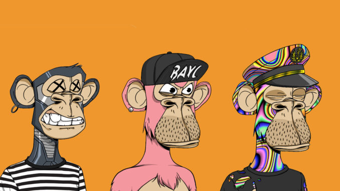

<!-- PROJECT LOGO -->
<br />
<p align="center">
  <a href="https://github.com/rom1trt/bayc_subgraph">
    
    
  </a>

  <h3 align="center">Bored Ape Yacht Club API (The Graph)</h3>

  <p align="center">
    An API that enables you to search information regarding the infamous Bored Ape Yacht Club NFTs.
    <br />
    <a href="https://github.com/rom1trt/bayc_subgraph"><strong>Explore the docs »</strong></a>
    <br />
    <br />
    <a href="https://github.com/rom1trt/bayc_subgraph">View Demo</a>
    ·
    <a href="https://github.com/rom1trt/bayc_subgraph/issues">Report Bug</a>
    ·
    <a href="https://github.com/rom1trt/bayc_subgraph/issues">Request Feature</a>
  </p>
</p>

<!-- TABLE OF CONTENTS -->
<details open="open">
  <summary>Table of Contents</summary>
  <ol>
    <li>
      <a href="#about-the-project">About The Project</a>
      <ul>
        <li><a href="#built-with">Built With</a></li>
      </ul>
    </li>
  </ol>
</details>


<!-- ABOUT THE PROJECT -->
## About The Project

#### Basic query regarding the tokens

```graphql
{
  tokens(first: 5) {
    id
    tokenID
    contentURI
    imageURI
    eyes
    background
    hat
  }
 ```
 
 #### Basic query regarding the users/owners
 
 ```graphql
 users(first: 5) {
    id
    tokens {
      id
    }
 ```
 
 #### Query tokens by owner

```graphql
{
  tokens(
    where: {
      owner: "0x9056d15c49b19df52ffad1e6c11627f035c0c960"
    }
  ) {
    id
    tokenID
    contentURI
    collection
    eyes
    background
    hat
    mouth
    clothes
    fur
    earring
  }
}
```
 
However, except one or two news' sources, few accounts commented events on a daily basis as well as analyzed technical indicators.
### Built With

This section should list any major frameworks that you built your project using. Leave any add-ons/plugins for the acknowledgements section. Here are a few examples.
* [The Graph](https://www.thegraph.com/)
* [GraphQL](https://graphql.org)


